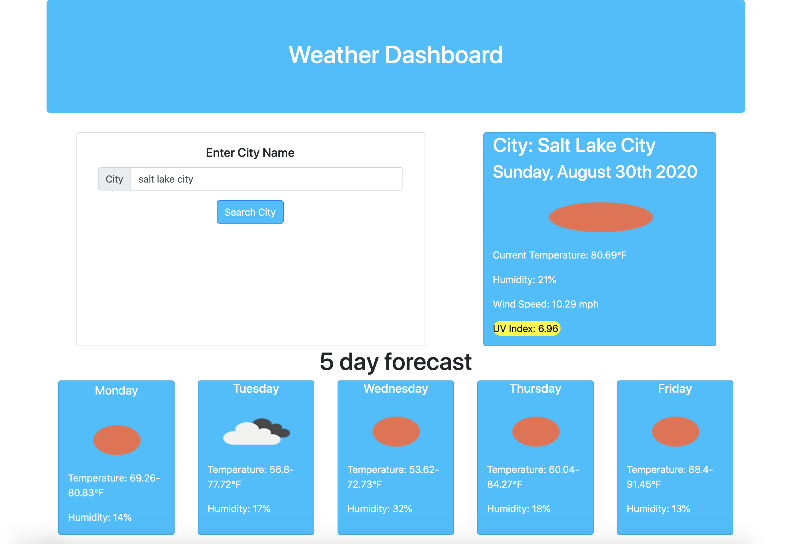

This is a simple weather app that allows the user to search for a city and the app will show the current weather, and a 5 day forecast. If you drop down the search city bar, it will show your most recent search. 

API's used-

Open Weather API's
https://api.openweathermap.org/data/2.5/weather?q={city name}&appid={your api key}
https://api.openweathermap.org/data/2.5/onecall?lat={lat}&lon={lon}&
exclude={part}&appid={YOUR API KEY}

Resources Used-

Bootstrap css framework
Moment.js
Jquery

I'd like to thank Elizabeth Hennessy for her help

Thanks!